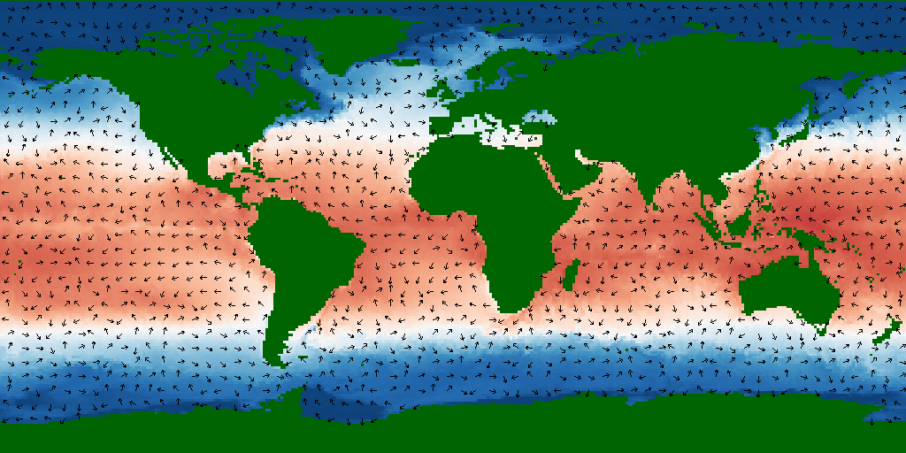
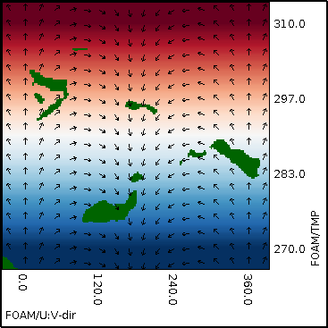

## Arrows {#arrows}

This example XML file displays sea water velocity direction as arrows on top of sea surface temperature plotted as a colour map.
[include](arrows.xml)

The resulting output image is shown below:

The legend for the map is below:
