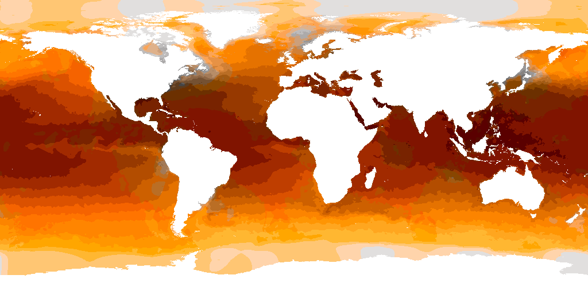
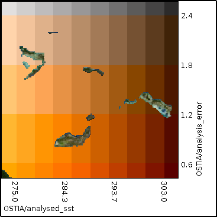

## Bivariate colour map {#bivariate-colour-map}

This example XML file displays a reanalysis of sea surface temperature and the analysis error as a perceptually uniform bivariate colour map (CIECAM02). The lightness varies with temperature and colorfulness with the error. An external program was used to generate the RGB values that are closest to the CIECAM02 values. There is an error in this encoding, which is the distance between the RGB and CIECAM02 values in the colour space. If this is less than 1 then the error is small, which it is not for all of the values in the XML below. The name of the user layer is ignored by the parser.
[include](bivariate.xml)

The resulting output image is shown below:

The legend for the map is below:
