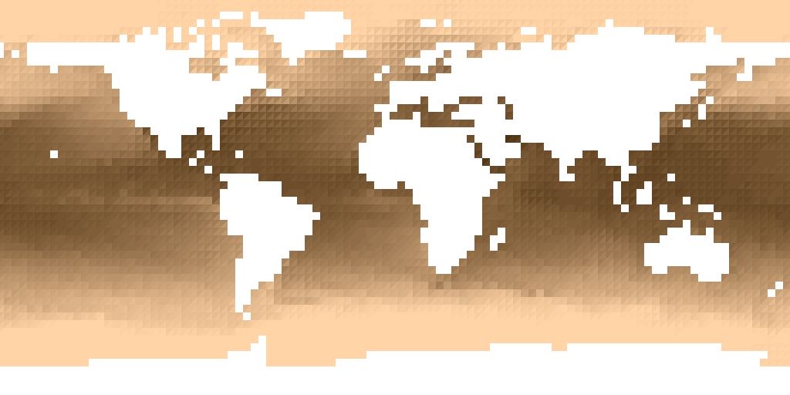
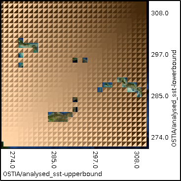

## Confidence interval triangles {#confidence-interval-triangles}

This example XML file plots sea surface temperature using confidence interval triangles to show the uncertainty with a perceptually uniform colour map (CIECAM02). An external program was used to encode the CIECAM02 values into sRGB. There is an error in doing this as explained in bivariate colour maps above. The colours were chosen in this case to be ones with small errors (less than 1). The magnitude of the SST is represented by lightness and the degree of uncertainty is shown by the contrast between the upper and lower confidence bounds.

[include](confidence_interval_triangles.xml)

The resulting output image is shown below:

The legend for the map is below:
