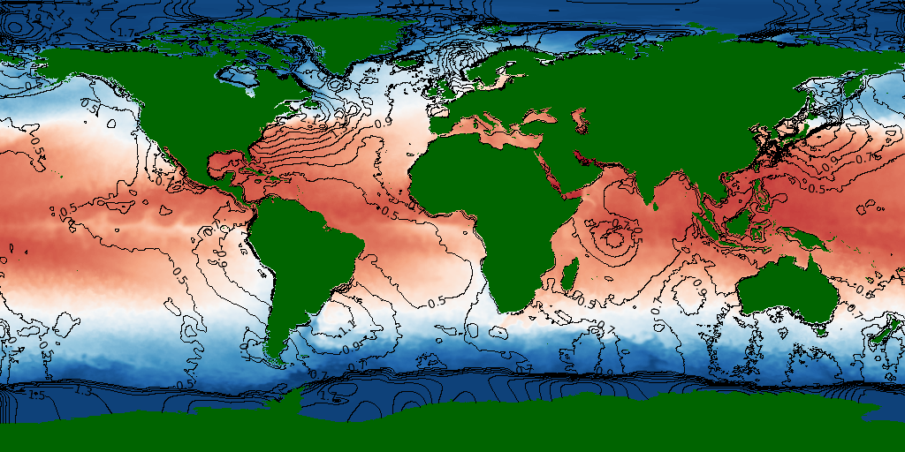
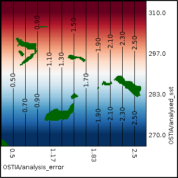

## Contours {#contours}

The following example XML file shows a reanalysis of sea surface temperature as a colour map, with the analysis error as contours.
[include](contours.xml)

The resulting output image and its legend are shown below:

