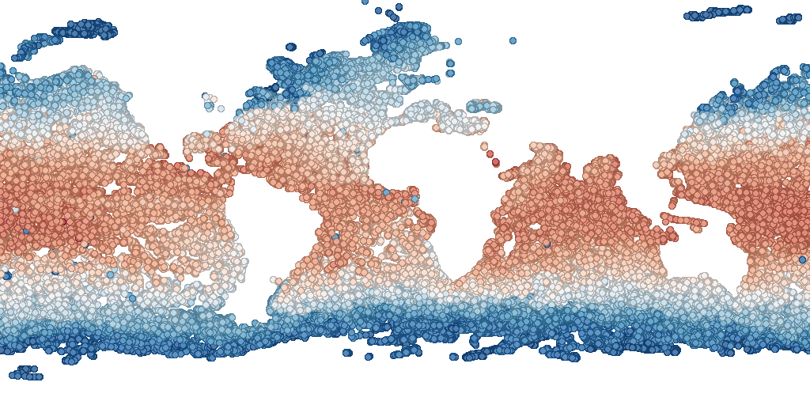
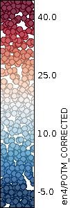

## In-situ coloured glyphs {#in-situ-coloured-glyphs}

This example XML file displays in situ measurements of sea surface temperature a coloured glyphs.
[include](in_situ.xml)

The resulting output is shown below:

The legend for the map is below:

