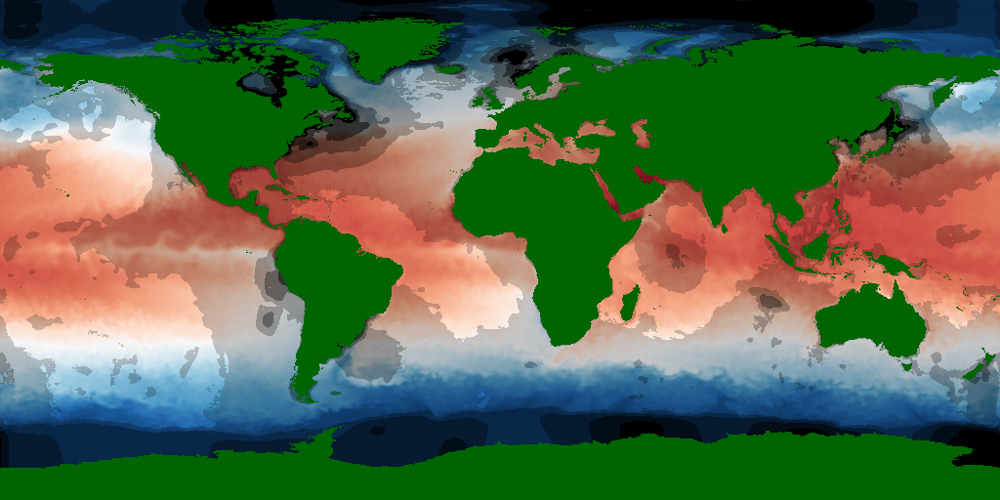
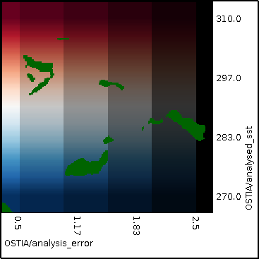

## Palette {#palette}

This example XML file displays a reanalysis of sea surface temperature as a named red-blue palette and the analysis error as bands of blackening specified using thresholds.
[include](palette.xml)

The resulting output image and its legend are shown below:

