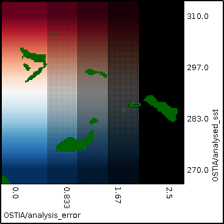

## Stippling {#stippling}

The following example XML file shows the analysis error as stippling on top of a reanalysis of sea surface temperature.
[include](stippling.xml)

The resulting output image and its legend are shown below:

